# 🧬 aitomics
Aitomics is a simple library for interacting with local LLMs (through LM Studio) that provides traceable transformations and basic comparison of LLM outputs with programmatic or manual results. The library is designed to make it easy to work with local LLMs while maintaining transparency in your transformations.

## 📑 Table of Contents
- [Features](#features)
- [Getting Started](#getting-started)
  - [Prerequisites](#prerequisites)
  - [Installation](#installation)
- [Core Concepts](#core-concepts)
  - [Callers and Responses](#callers-and-responses)
    - [Response Structure](#response-structure)
    - [Creating Responses from External Data](#creating-responses-from-external-data)
  - [Comparison Models](#comparison-models)
  - [Utilities](#utilities)
    - [YAML-based Prompt Configuration](#yaml-based-prompt-configuration)
    - [LLM Configuration](#llm-configuration)
  - [Standard Library](#standard-library)
    - [Basic Utilities](#basic-utilities)
    - [Analysis Utilities](#analysis-utilities)
    - [Custom Utilities](#custom-utilities)
  - [Visualization](#visualization)
  - [Serialization](#serialization)
  - [Cursor Integration](#cursor-integration)

## ✨ Features
- 🔄 Traceable transformations with linked response history
- 🔍 Basic comparison tools for evaluating LLM outputs
- 🛠️ Simple utility functions for common tasks
- 🔌 Configurable LLM access
- 📊 Flow diagram visualization of transformation pipelines
- 💾 Response serialization for continuous data processing

## 🚀 Getting Started

### 📋 Prerequisites
- 🖥️ [LM Studio](http://LMstudio.ai) running locally
- ⚡ Node.js installed
- 🤖 A local LLM model (defaults to llama-3.2-3b-instruct)

### 📦 Installation
```bash
npm install aitomics
```

## 🎯 Core Concepts

### 1. 📞 Callers and Responses
The library's core functionality revolves around `Callers` and `Responses`. A `Response` acts as a linked list, allowing you to trace multiple transformations while maintaining the history of changes. Here's a basic example (where we explicitly name the caller):

```js
import { $, _ } from 'aitomics'

// Create an LLM caller
const caller = $("Replace all whitespaces with underscore _ ", "whitespace-replacer-1")

const input = "Some Text String"

// Pass an input, receive a response
const result = await caller.run(input)

// Access the output
console.log(result.output) // Some_Text_String

// Compose multiple callers
const caller2 = _.compose(caller, _.lowerCase)

const result2 = await caller2.run(input)
console.log(result2.output) // some_text_string

// Access previous transformation
const prev_result = result2.input
console.log(prev_result.output) // Some_Text_String
```

Each caller must have a unique ID. If no label is provided, a hash is generated automatically. However, if you create multiple callers with the same functionality, you must provide unique labels to avoid conflicts. Different functionality callers can exist without labels, but duplicate unlabeled callers will throw an error. The label is also used for visualization purposes, helping to create clear and descriptive representations of the transformation pipeline as described in the [Visualization](#visualization) section.

The example is detailed further under 📚 [`examples/SimpleApplication.js`](examples/SimpleApplication.js) 
A complete example is also found under  📚 [`Customer Review Analysis Example`](examples/CustomerReviewAnalysisExample.js) 

#### Response Structure
All responses follow this structure:
```js
{
  output: String | Object,
  caller: Caller,
  input: String | Response,
  generator: generatingType, // INPUT, PROGRAMMATIC, CUSTOM
  root: boolean,
  level: number
}
```

#### Creating Responses from External Data
You can also create responses directly from external data using `Response.create()`. This is useful when you want to load data from other sources or create responses without using a caller:

```js
import { Response } from 'aitomics'

// Create a response from external data
const response = Response.create(
  output: "Some data from external source",
  input: "Original input", // important to ensure is correct, as we cannot compare responses with different inputs.
)

// The response will have the same structure as those created by callers
console.log(response.output) // "Some data from external source"
console.log(response.generator) // "CUSTOM"
```

This is particularly useful when:
- Loading data from files or databases
- Creating responses for comparison with LLM outputs
- Testing or mocking responses in your application

### 2. ⚖️ Comparison Models
Aitomics provides basic comparison tools to evaluate LLM outputs. You can use:
- ✅ `EqualComparisonModel` for exact string or list matching
- 📏 `DistanceComparisonModel` for simple agreement (closeness)
- 🤝 `KrippendorffsComparisonModel` for inter-rater reliability (IRR) with single label 
- 🤝 `CohensComparisonModel` for inter-rater reliability (IRR) with multiple labels, also supports multiple reviewer labels

Here's a basic comparison example:

```js
// Create two different transformations
const caller1 = $("Take all words and make them elements in a JSON array")
const caller2 = $((i) => i.toUpperCase().split(" ")) // A programmatic caller, which just applies a function to the input

const input = "SOME text string"

// Get results from both transformations
const result1 = await caller1.run(input)
const result2 = await caller2.run(input)

// Compare the results
const comparison = result2.compare(result1).run(new EqualComparisonModel())
console.log(comparison) // 0.33 (3% agreement)
```

Both `KrippendorffsComparisonModel` and `DistanceComparisonModel` support custom weight functions to fine-tune the comparison. The weight function allows you to define how different values should be weighted in the comparison, giving you more control over the agreement calculation.

Note that `CohensComparisonModel` and `KrippendorffsComparisonModel` are multi-response comparison models, meaning they can handle multiple responses from different raters.

**Krippendorff's Alpha Handling:** The `KrippendorffsComparisonModel` uses a hybrid approach:
*   For **single-label data** (like numeric scores or single categories), it applies the standard Krippendorff's calculation and respects the provided `weightFn` for nuanced agreement.
*   For **multi-label data** (where reviewers provide arrays of labels), it calculates observed agreement using the Jaccard index between label sets, providing a more structurally appropriate measure. In this multi-label mode, the `weightFn` is ignored, and the expected agreement calculation uses a simplified formula, making the resulting alpha an approximation.

For more examples, check out:
- 📚 [`Simple Application`](examples/SimpleApplication.js) - Basic usage examples
- 📚 [`Comparison Application`](examples/ComparisonApplication.js) - Simple comparison examples
- 📚 [`Distance Comparison Example`](examples/DistanceComparisonExample.js) - Using distance-based comparisons
- 📚 [`Krippendorff's Comparison Example`](examples/KrippendorffsComparisonExample.js) - Using Krippendorff's alpha
- 📚 [`Cohen's Comparison Example`](examples/CohensComparisonExample.js) - Using Cohen's kappa
- 📚 [`Product Review Multi-Label Example`](examples/ProductReviewMultiLabelExample.js) - More complex multi-label comparison using Krippendorff's alpha with Jaccard index.
- 📚 [`Store Review Comparison Example`](examples/StoreReviewComparisonExample.js) - Example comparing multiple reviewers (with a single label) using Krippendorff's alpha.

### 3. 🛠️ Utilities

#### 📝 YAML-based Prompt Configuration
You can structure your prompts using YAML files:

```yml
prompt:
    description:
        - multiple lines of prompt content
        - can go here
    values:
        - label: myLabel
          description: a description of the label
        - label: otherLabel
          description: another description of label
    default_value: unknown
```

Usage:
```js
import { parseCategorizationPromptFromYML } from 'aitomics'
parseCategorizationPromptFromYML("filename.yml")
```

The default prompt template is a simple transformation that:
1. Takes the descriptions as individual context messages
2. Maps labels to strings
3. Adds a sentence about the default value

You can override this template using `setPromptTemplate`. The template function should have the signature:
```js
(descriptions: string[], values: {label: string, description: string}[], default_value: string) => string[]
```

Example of overriding the template:
```js
import { setPromptTemplate } from 'aitomics'

setPromptTemplate((descriptions, values, default_value) => [
  "Please categorize the following text:",
  ...descriptions,
  "Available categories:",
  ...values.map(v => `- ${v.label}: ${v.description}`),
  `If none of the above categories fit, use: ${default_value}`
])
```

#### 🔌 LLM Configuration
By default, aitomics uses `./src/util/fetch/default_config.yml` for LLM settings. You can override this by:

```js
import { setConfigFromFile, setConfigFromObject } from 'aitomics'

// Using a file
setConfigFromFile("./config.yml")

// Or using an object
const config = {
    model: "llama-3.2-3b-instruct",
    path: "https://127.0.01",
    port: 1234,
    endpoint: "v1/chat/completions",
    settings: {
        temperature: 0.7,
        max_tokens: -1,
        stream: false
    }
}
setConfigFromObject(config)
```

The config file (`config.yml`) should follow this structure:
```yaml
model: llama-3.2-3b-instruct  # The model name to use
path: https://127.0.0.1       # The base URL for the LLM API
port: 1234                    # The port number
endpoint: v1/chat/completions # The API endpoint
settings:
  temperature: 0.7            # Controls randomness (0.0 to 1.0)
  max_tokens: -1              # Maximum tokens to generate (-1 for unlimited)
  stream: false               # Whether to stream the response
```

### 4. 📚 Standard Library
The library provides a  set of utility callers through the `_` namespace that can be used to transform and analyze responses.

#### Basic Utilities
Simple transformations like:
- `_.lowerCase` - Convert text to lowercase (in a new response)
- `_.upperCase` - Convert text to uppercase (in a new response)
- `_.stringToJSON` - Parse text into JSON object (in a new response)
- `_.JSONToString` - Stringify a JSON object (in a new response)
- `_.extract(param)` - extracts the specified param and uses that as output (in a new response)

#### Analysis Utilities
More complex utilities that analyze LLM outputs:
- `_.inference` - Analyzes how well an LLM's response follows from its input (based on a new analysis by the same model)
- `_.confidence` - Evaluates how confident the LLM is in its response (based on a new analysis by the same model)
- These can be chained: `_.compose(_.inference, _.confidence)`
- To support further comparison / IRR calculations on this, one can use `_.extract(param)` to do so.

Note: Utility Callers must either receive a response with an output which is either a string, or an object with an `output` property, as it is this which will undergo analysis. 

Each utility call enhances the output with additional properties (in a new response)
```js
{
  output: <previous output>,
  inference: <inference level>,
  confidence: <confidence level>,
  // ... any other utility-specific attributes, or any previous parts of the output object (i.e., multiple Analysis Utility Callers do not create nested output properties)
}
```

#### Custom Utilities
You can create your own utility callers using `createUtilityAnalysisCaller`:
```js
const customUtility = createUtilityAnalysisCaller({
  name: "custom-utility",
  variable: "custom",
  prompt: "Your custom analysis prompt here" // which gets the previous output, input, and prompt to make its analysis
})
```

For a complete example of using these utilities, check out:
- 📚 [`Inference Confidence Example`](examples/InferenceConfidenceExample.js)

### 5. 🎨 Cursor Integration
The library includes rules for Cursor IDE integration. The rules are automatically installed to `.cursor/rules/aitomics.rules` during package installation for code completion and suggestions.

### 6. 📊 Visualization
The library provides a visualization tool that generates [Mermaid](https://www.mermaidchart.com/play) flow diagrams to help you understand and document your transformation pipelines. The visualization shows:

- The flow of data through different callers, with example data, if needed.
- Caller names in the diagram: 
  - Named callers will show their provided name
  - Unnamed callers will show their generated ID (a hash of their function/prompt)
  - When using `Response.create()`, you can provide a custom name to make the visualization more meaningful

Here's an example of a generated diagram from the `ProductReviewMultiLabel` example:

<div align="center">
  
</div>

For a complete example of how to generate such visualizations, check out:
- 📚 [`Visualization Example`](examples/VisualizationExample.js?) - Shows how to generate and save flow diagrams
- 📚 [`Response Create Example`](examples/ResponseCreateExample.js) - Demonstrates how to use `Response.create()` with custom names and how this affects visualization

The visualization supports several configuration options:
- `labels`: Array of labels for each flow path in the same order as the input responses array
- `showExampleData`: Toggle to show/hide example data on arrows (default: false)
- `initialInputIndex`: Specify which response to use for example data (default: 0)

Using the visualization function requires a variable list of `Response` (lists) as input which is used to trace the transformation. Output is both the markdown and generated svg.

**Note on Caller Names:** When creating visualizations, it's important to consider how caller names will appear:
- For LLM and programmatic callers, always provide a meaningful name using the second parameter of `$()` to make the diagram more readable
- For responses created with `Response.create()`, provide a custom name that reflects the data source or purpose
- Unnamed callers will show their generated ID in the diagram, which can make it harder to understand the flow
- Duplicate caller names (even between real and dummy callers) will be merged in the visualization

### 7. 💾 Serialization
Aitomics provides simple serialization capabilities for Response objects, allowing you to save and load transformation chains. The serialization process:

- Stores responses as JSON files with a simple header for format validation
- Preserves the complete chain of transformations
- Maintains links to callers when they are available
- Handles nested responses properly

Basic usage:
```js
import { writeResponses, readResponses } from 'aitomics'

// Save a response chain
writeResponses("responses.json", response)

// Load responses back
const loadedResponses = readResponses("responses.json")
```

Important notes about caller linking:
- It's recommended to have callers loaded before reading responses to ensure proper association
- Callers can also be loaded after reading responses - they will be linked automatically
- Be cautious with caller IDs: if a new caller is created with the same ID as a previously saved one, they will be treated as the same caller in the trace

For a complete example of serialization usage, check out:
- 📚 [`Response Serialization Example`](examples/ResponseSerializationExample.js) - Shows how to save and load response chains

For examples of using inference and confidence utilities, check out:
- 📚 [`Inference Confidence Example`](examples/InferenceConfidenceExample.js) - Shows how to use `_.inference` and `_.confidence` to rate LLM responses
